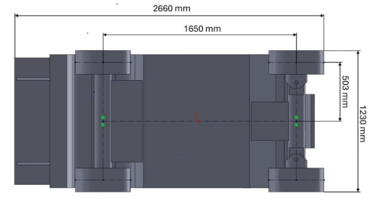
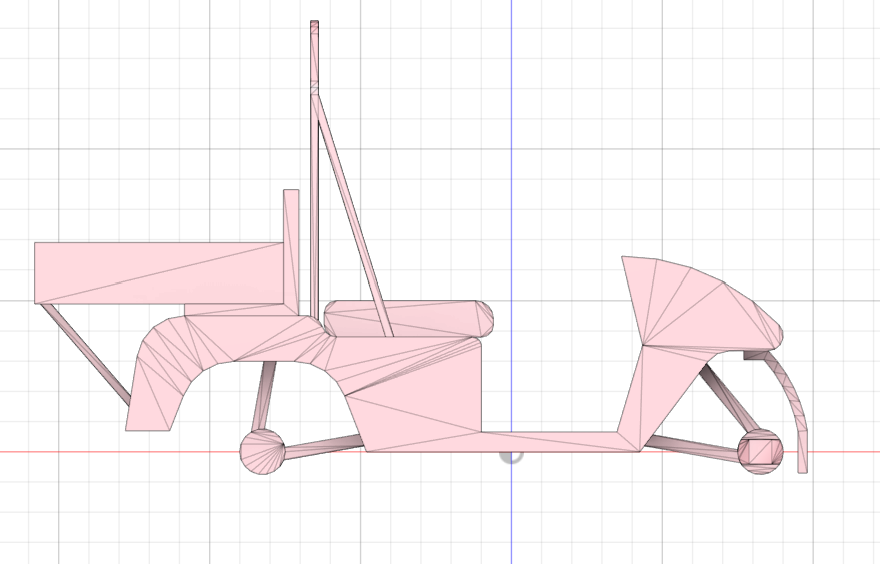
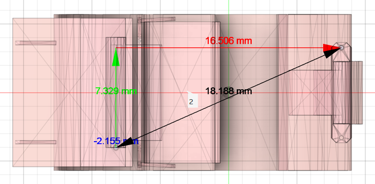
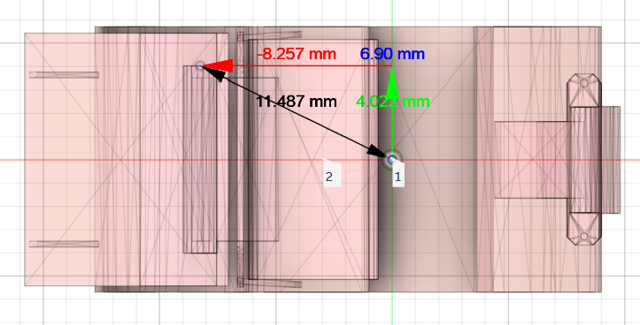
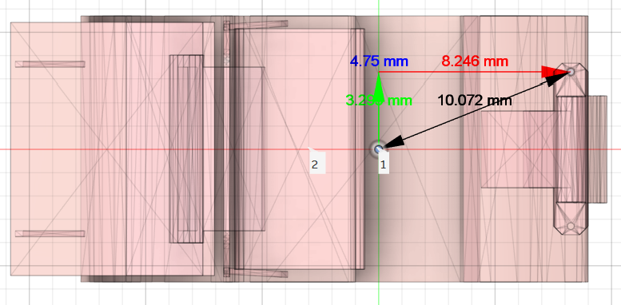

# Caddy AI2 ROS2 Simulation

## Medidas

## Apartado visual
A la hora de hacer la simulación, se tiene un archivo aproximado del chassis del vehículo. Cómo podemos ver en las siguientes imágenes, tiene un alinamiento definido con respecto a los ejes del vehículo, pero no este no tiene en cuenta el centro de masas del vehículo. Y por lo tanto, para el aspecto visual, hay que hacer un aliniamiento, teniendo en cuenta las medidas aproximadas obtenidas, a parte de considerar la escala.

# TODOs

- [ ] Medir los aspectos reales del vehículo, cómo el centro de gravedad, masa del vehículo, etc. Añadir documento de como se mide esto y hacer fotos.